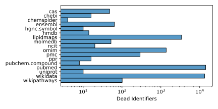

[](https://github.com/bridgedb/tiwid/actions/workflows/qa.yml)
[](https://zenodo.org/badge/latestdoi/334110717)

# This is where identifiers die

This project collects identifiers that are, for some reason, no longer pointing to active records
in the corresponding database. As such, these identifiers should no longer be used. By collecting
them in a machine readable way, we can make it easier to automate the detection of dead identifiers
in data curation workflows.

The following is a short summary of the contents of this resource:



## Data

The data in the `data` folder is structured like as follows. Filenames follow the namespace of
the resources as defined by identifiers.org and used in compact identifiers. The content of
the file is a comma-separated values file with one or more columns:

* `#did`: the dead identifier
* `when`: when the identifier stopped being used
* `nextofkin`: the identifier that replaces the identifier (for some reason)

This model is incomplete and volatile, but applies to Release 1.

A collation of all curations can be found in [`artifacts/collated.tsv`](artifacts/collated.tsv).

## Tests

Run tests using `tox` with the following commands in the shell:

```shell
$ pip install tox
$ tox
```

The tests are also run using GitHub Actions following all commits to the main branch
and pull requests to the main branch.
